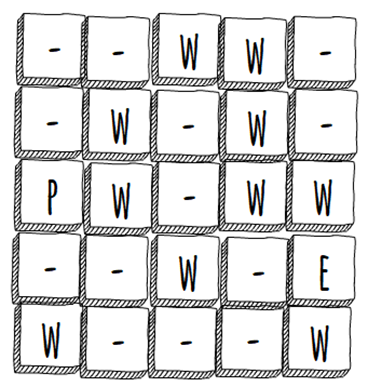

# Esercizio Labirinto 
 
Scrivete un programma che permette ad un utente di giocare al vostro labirinto. Per farlo potrà scrivere sulla console di java le lettere «WASD» per muoversi (come in molti videogiochi per PC). Quando il giocatore raggiunge il traguardo, verrà avvisato di aver vinto e il programma termina.

Implementazione:
 
La e è la nostra uscita o exit, p siamo noi e w sono il wall

# Matrice di Default
 
